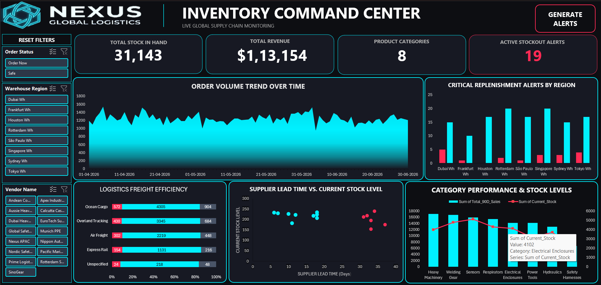

# Excel Supply Chain Dashboard & Automated Procurement

This project is a functional, end-to-end supply chain tool built to solve a common operational problem: the time lag between spotting inventory shortages and notifying the purchasing team. 

Instead of relying on heavy plugins or external software, the entire system runs natively within Excel using Power Query and VBA, making it lightweight and easy to deploy on standard office machines.

---

## 📊 Dashboard Preview

*(Note: Upload your actual dashboard screenshot to your repository with this exact file name to display it here).*

---

## 🛠️ How It Works

### 1. Data Cleaning & Connections (Power Query)
* **Automated Data Prep:** Connects directly to raw supply chain sheets, eliminating the need to manually copy and paste new weekly data.
* **Data Formatting:** Cleans up structural errors, normalizes regional data formats, and removes duplicate rows automatically.
* **Performance Optimization:** Builds a clean, indexed data model that handles thousands of rows while keeping the workbook fast and responsive.

### 2. User Interface & Controls
* **Dynamic Filtering:** Uses synchronized slicers across multiple pivot tables, allowing users to filter by region, stock status, and timeline simultaneously without messing up the layout.
* **One-Click Reset:** Features a simple macro mapped to a control button that instantly clears all active filters and returns the dashboard to the default view.

### 3. Automated Reorder Engine (VBA)
* **Row Auditing:** Runs a quick background loop that scans active inventory rows to check current stock numbers against target safety stock levels.
* **Text Compilation:** Automatically pulls the SKUs, item names, and exact shortages for any product that falls below safety limits, formatting them into a clear summary.
* **Outlook Integration:** Uses native system hooks to open a pre-formatted Outlook email draft populated with the purchasing team's address, a clear subject line, and the itemized shortage list—removing manual data entry entirely.

---

## 📋 How to Use the Project

1. **Refresh the Data:** Open the workbook and click "Refresh All" to pull the latest supply chain records through the Power Query pipeline.
2. **Analyze the Data:** Use the visual slicers on the dashboard to spot regional trends or active stockouts.
3. **Trigger the Automation:** Click the **"Generate Alerts"** button on the screen. The script instantly runs the inventory check and creates your email draft.

---

## ⚙️ Setup Instructions

To test the dashboard and automation tools locally:

1. Download the `Nexus_Inventory_Command_Center.xlsm` file from this repository.
2. Open the file using desktop Microsoft Excel.
3. **Note:** Click **"Enable Macros"** on the yellow security banner at the top of the screen when opening the file, as the filter reset and email generation functions depend entirely on the embedded VBA code.
